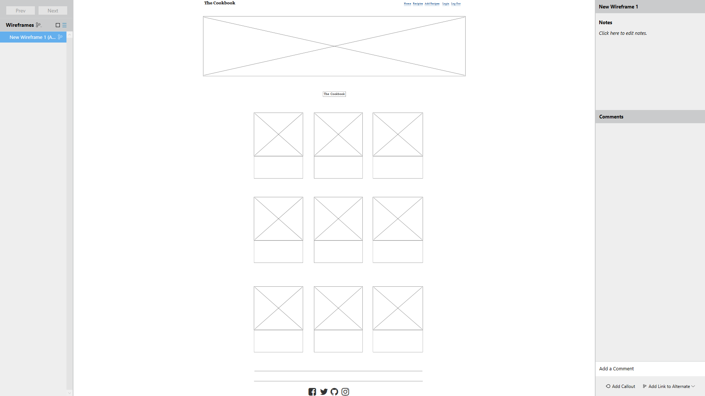
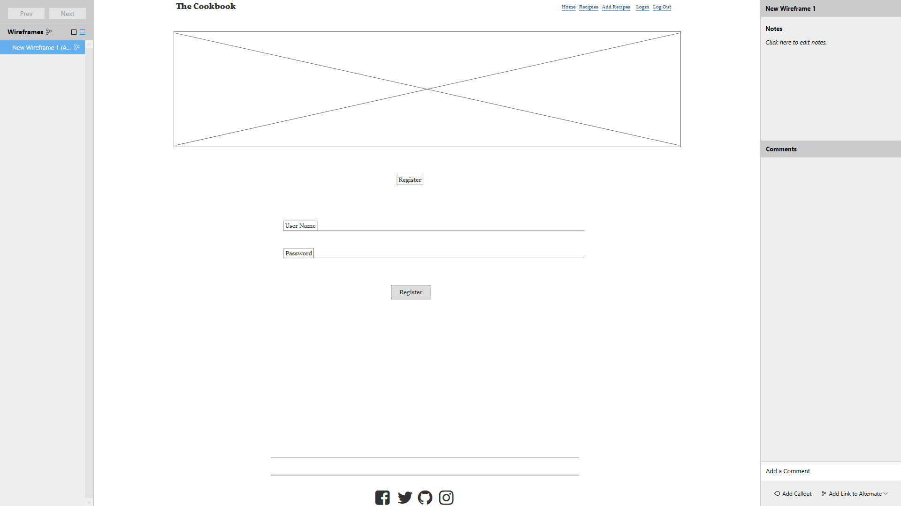
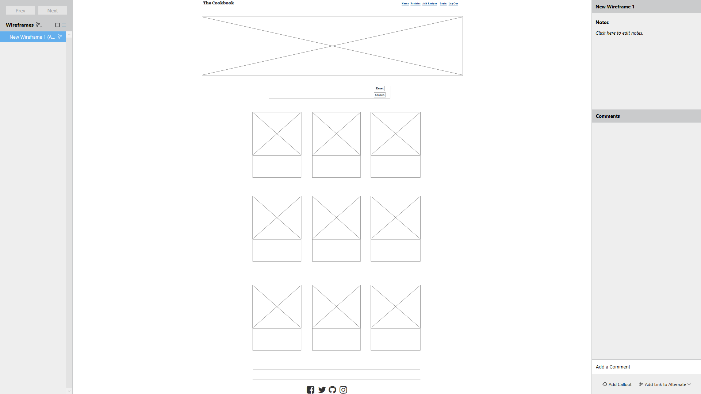

MileStone README.md

### ** Milestone 3 Project**

Welcome! [View live project here]

Milestone Project 3 Home Page

### **UX - User Experience Design:**
This website was created for Goals
The goal of this website is so that, users can join an online family of food lovers submit to a library of free recipes. Users should feel like they are right at home with full access to all cooking recipes once registered and also be able to contribute their recipes as well.

#### User Stories
- As a first-time visitor, I want to easily understand the project from the moment you get to the landing page.
- As a first-time visitor, I want to easily be able to navigate, be able to go back and forth to pages quickly.
- As a first-time visitor, I want the project to not be too exhausting to look at.
- As a first-time visitor, I want to able to pick back up from where I left off, so I can simply just carry on if I took a break? 
- As a first-time visitor, I would like to be able to create a new account and also be able to log in/out of the account.
- As an existing - One must feel like cooking and trying out various recipes once visited the site.

#### Wireframes, mockups, diagrams, etc

#### Wireframe 1:
Home Page 
#### Wireframe 2:
Log In Page 
#### Wireframe 3:
Register Page 
#### Wireframe 4:
Recipes Page 
#### Wireframe 5:
Add Recipes Page 

### **Features:**
#### Features presented across the project
- Navbar - Responsive, toggles to a hamburger menu on smaller devices. 
- Before logging in the available links are Home, Login, and register, after logging in it becomes Home, Recipes, Add Recipe, and Logout.
- Users can register and create an account. 
- Consistent images are used throughout the project. All images are relevant to the content.
- The contrast of fonts between header and proceeding text and color, helps bring the page to life.
- There are kitchen items for a sail on the main page.
- Users can add their recipes.
- Users can edit and update recipes that they have submitted.
- Search bar for recipes where users can search any keyword related to the recipe that they want.
- Ability to add recipes using the user's local storage.
- Fixed Navbar so users can always find their way around.
- Form validation.
- Collapsible navbar on mobile view.
- Footer with access to social links.
- Recipe library displayed in cards with images.
- User registry and log in.
#### Features Left to Implement
- I would like to expand more on the Profiles page showing more in-depth information about the user.
- Users are only able to update and delete recipes if it was submitted by them.
- Ability to rate the recipes and users to comment.
- More information such as servings, calories, nutrition value, etc.
- The ability to review recipes before the website displays them.
- Auto-sizer and optimizer for photos.
- Improve Search feature.
#### Features presented on individual pages
#### Home page
- This page comprises nav links a slider displaying various foods and giving an encouraging welcome messaging to all fellow cooks encouraging them to register and become a part of our family. There are Farberware kitchen utensles and apliences on sale. At the middle of the page are three recipe templates but you need to register and create an account to full access to the site.
####  Login page 
- Where existing users can log into their accounts.
#### Register page
- Where new users can create an account.
#### Recipes page
- Where all the recipes on the site can be viewed.
#### Add Recipes page
- Where new recipes can be added to the site.
#### Show Recipes page
- Where the full recipe is shown with ingredients steps cooking time and so on.
#### Edit Recipes page
- Registered users can update and modify their existing recipes.

### **Technologies Used:**
- [HTML](https://developer.mozilla.org/en-US/docs/Web/HTML)
    - Used as the building block for the project and to structure the content.
- [CSS](https://developer.mozilla.org/en-US/docs/Learn/Getting_started_with_the_web/CSS_basics)
    - Used to style all the web content across the project.
- [Materializecss](https://materializecss.com/)
    - Used as the main framework to make the project responsive.
- [jQuery](https://jquery.com/)
    - Used with Bootstrap to make the navbar responsive.
- [JavaScript](https://www.javascript.com/)
    - Used for the Bootstrap navbar extending collapse plugin to implement responsive behavior.
- [Google Fonts](https://fonts.google.com/)
    - Used to obtain the fonts linked in the header, fonts used were Roboto and Exo.
- [Font Awesome](https://fontawesome.com/)
    - Used to obtain social media icons used in the footer.
- [Google Developer Tools](https://developers.google.com/web/tools/chrome-devtools)
    - Used as a primary method of fixing spacing issues, finding bugs, and testing responsiveness across the project.
- [Github](https://github.com/)
    - Used to store code for the project after being pushed.
- [Git](https://git-scm.com/)
    - Used for version control by utilizing the Gitpod terminal to commit to Git and push to GitHub.
- [MongoDB/Atlas](https://www.mongodb.com/cloud/atlas/lp/try2?utm_source=google&utm_campaign=gs_emea_sweden_search_core_brand_atlas_desktop&utm_term=mongodb&utm_medium=cpc_paid_search&utm_ad=e&utm_ad_campaign_id=12212624566&gclid=Cj0KCQiAv6yCBhCLARIsABqJTjbydZR3PY_sGGq_fgvjaQU9OcyDR_X1-qKYIMxfkvdk4c7qQqS1pVcaAvfcEALw_wcB)
    - Used to store and grab user-submitted data for my website.   
- [Heroku](https://heroku.com/)
    - Used as the development environment.
- [WireframeSketcher](https://wireframesketcher.com/)
    - Used to create Wireframes for the project.
- [AutoPrefixer](https://autoprefixer.github.io/)
    - Used to parse my CSS and vendor prefixes.
- [Grammarly](https://app.grammarly.com/)
    - Used to fix grammar errors across the project.    

### **Testing:**
#### Submit recipe & Update function
- Multiple recipes were added and updated. Recipes checked to see if it was accurately added or updated.
- Checked to see any console log errors when adding and updating recipes.
#### Forms
- Tried to submit a recipe without filling the forms which the website will not allow. A prompt will tell users that forms need to be filled out.
- Tried filling Image URL text area with non-URL text which triggers the form validator.
- The update forms are pre-filled as intended.
- Update forms also will not let users submit unless all forms are filled correctly.
#### Links
- All links were tested and all links correctly redirect to the intended page.
- Social links redirect to the correct social.
#### Buttons
- All buttons work and execute their assigned functions.
####Search function
- Performed multiple searches using keywords and recipes associated to those keywords are displayed successfully.
#### User testing stories from User Experience Design (UX) Section
- 
#### Further Testing
- The project was tested on the following browsers with success, Google Chrome, Microsoft Edge,  Mozilla Firefox, and Opera.
- The project was manually tested on  Apple iPhone XS Max and a  Nexus 5X with success.
- Google Chrome Developer tools and responsivetesttool.com were used throughout the project to help with responsiveness across devices.
- Google Chrome Development tools and responsivetesttool.com used to emulate devices.

-The project is responsive on several of their devices Mobile, Tablet, Laptop / Desktop
-dev tools were also used to check responsiveness.
    - 

#### Syntax - HTML & CSS
<i class="far fa-clone"></i> Using https://validator.w3.org and filtering errors related to Angular (ex: no doctype,...)
- index.html (Home) &check;
- Login.html &check;
- register.html &check;
- Recipes.html &check;
- show_recipie.html &check;
- profile.html &check;
- edit.html &check;
- logout.html &check;
<i class="far fa-clone"></i> Using https://jigsaw.w3.org/css-validator/ I validated the following spreadsheet:

- defaultStylesheet.css: &check;

#### Navigation
#### Navigation on Mobile
- Navigation on mobile consisting of a hamburger droop down button with all the functionality of the larger devices Home, Login Register, Recipes, Add Recipes and Log Out.
#### Navigation on Tablet:
-  Navigation on tablet consisting of a hamburger droop down button with all the functionality Home, Login Register, Recipes, Add Recipes and Log Out.
#### Navigation on Desktop 
- Consist of A Navbar consisting of no hamburger droop down button with all functionality of Home, Login Register, Recipes, Add Recipes and Log Out.
#### Login, Logout and Register buttons
- all devices consist of these three buttons and they are all functional.
#### Known Bugs and fixes
-the base template slider was not present on all template pages so I created a second one called slider to facilitate these pages.
-I also got a lot of trouble in trying to achieve responsiveness on smaller devices using materializecss.
-Many errors came up when I checked my HTML was not quite sure if it was good or bad many of them seem to be from the python components I reached out to the tutors for advice but there was no response.
-I could latch on to the recipes for loop on the recipes page to apply propper CSS so as a result, my responsiveness on smaller devices suffered.
### **Deployment:**
- This project was built using Gitpod IDE, committed, and published using GitHub.

To run this project locally
Note: You will need to create a free MongoDB account and create your collection.

- Follow this link
- Click "Clone or Download".
- Copy the clone URL under the HTTPS section.
- Run the files in your local IDE.
- Upgrade PIP with
- $ pip install -U pip
- Install dependencies using
- $ pip3 install -r requirements.txt
- Create a env.py file with the data that matches my code. Place your own values.
- import os
- os.environ['MONGO_DB'] = 
- os.environ['MONGO_URI'] = 
- os.environ['SECRET_KEY'] = 
#### Deployment Process
  Heroku deployment
- Heroku was used to deploy this project with the following steps.

- Logged in to Heroku.
- Created a new file called "our-recipe" and picked the region closes to me.
- Under the Deploy section, I connected to Github and also connected to the repo associated.
- Under the Settings section, I updated the "Config Vars" to match my code
- Config Vars	Config Vars
- IP	0.0.0.0
- PORT	5000
- SECRET_KEY (hidden)
- MONGO_URI	(hidden )
- In my IDE, I entered my Heroku credentials and typed:
- $ git push Heroku master
- Back to Heroku, I selected "Enable Automatic Deployment"
- Selected "Master" as the branch.
- Wait for Heroku to finish and then click "Open app".

### **Authors:**
- This project was created by Robert P Narcis an upcoming full-stack software developer.
### **Credits:**
- CodeInststuite video tutorials
- Stack Overflow 
### **Content:**
- allrecipes all recipes taken from this site (https://www.allrecipes.com/)
### **Media:**
- Aquired randumly from the internet.
### **Acknowledgements:**
- CodeInststuite
- Stack Overflow 
